# Build a Digital Center of Excellence for Your Low-Code Developers
<!-- description --> IT-teams responsible for SAP Build can use this Digital Center of Excellence to communicate with and enable their low-code developers – especially the citizen developers who require a more business-user-friendly approach. Take over the white label template and customize it to fit your organizations needs! Scale your enablement activities with ease and grow your community of practice by leveraging the vast amount of free learning content from SAP.

## You will learn  
  - Why you need a hub for low-code developers
  - How to build your Digital CoE using SAP Build Work Zone, Advanced edition
  - How to change and customize the widgets and content

## Prerequisites  
 - A subaccount in SAP BTP that includes a subscription to the SAP Build Work Zone, advanced edition service, has already been setup for you
 - Access SAP Build Work Zone, advanced edition from the SAP BTP Training Subaccount | [Tutorial](https://developers.sap.com/tutorials/workzone-workshop1-access.html)
 - Access SAP Build Work Zone, advanced edition from the SAP Build Lobby  | [Tutorial](https://developers.sap.com/tutorials/workzone-access-sap-build.html)
 - Creativity & Ideas

## Intro

As an IT Admin, you play a pivotal role in determining how effectively your organization can leverage technology. The rise of low-code platforms has democratically opened the doors to software development, making it accessible even to those without formal coding skills. But this doesn't negate the need for expert supervision and user enablement — in fact, this is where a Digital Center of Excellence (CoE) comes into play.

The Digital CoE serves as a guiding force, a one-stop hub, where you can share standardized protocols, best practices, learning content, and support citizen developers in building software solutions. It contains forums and content for skills development and drives the capability of the organisation for using low-code visual programming to create apps, automate processes, and build business sites. Furthermore, it can also be used as a repository for your use-case portfolio. 

In fact, because it is based on SAP Build Work Zone, advanced edition, setting up the Digital CoE is also a great first step for you to get to know SAP's low-code tool set.

The Digital CoE can accelerate the time to value of your low-code program by improving IT-readiness, providing a channel for change management, enabling the analysis of use case ideas and portfolio management, and communicating with citizen developers in a way that us business-friendly.

>Objective of this tutorial: *Take over our template and give it your own branding and ideas & you're already good to go!*

What does the **SAP Build Digital Center of Excellence** toolkit contain?

  - Platform to notify, inform and teach your Citizen Developers 
  - Collaboration and interaction between your new low-code audience and your IT department
  - Enablement material to learn, try out and get inspired
  - Opportunities to share knowledge, get help and exchange ideas in the forum
  - Promotion of community calls, workshops and build-a-thons

### Get the template

1. [Sign up](https://url.sap/f96fc8) to get access to our SAP Build Governance resource center. Within it you will find the needed template!
    
    <!-- size:300px -->
    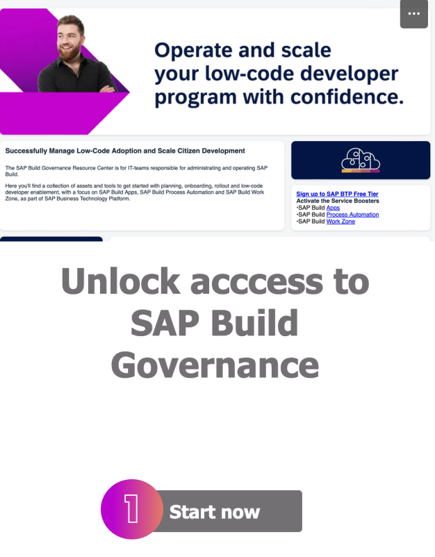

2. Then click on "accept" in the email invitation that will be sent to you. Access requests may take several minutes to verify and trigger the email, so kindly be patient.
    
    <!-- size:400px -->
    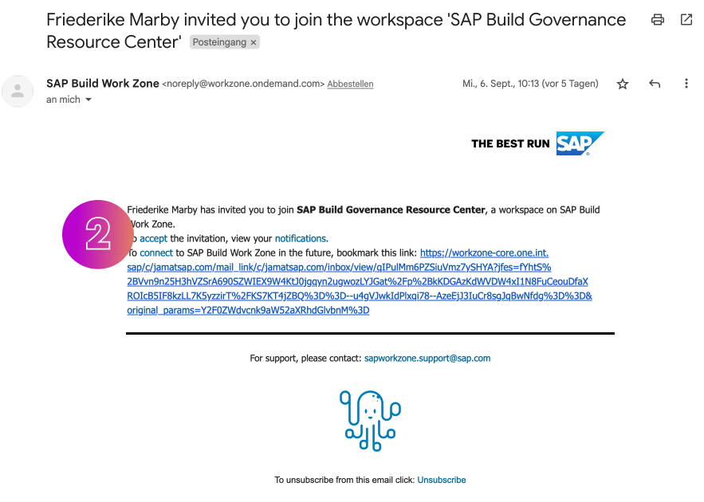

3. Log-in with your SAP universal ID or quickly create a new one.    
    
    <!-- size:300px -->
    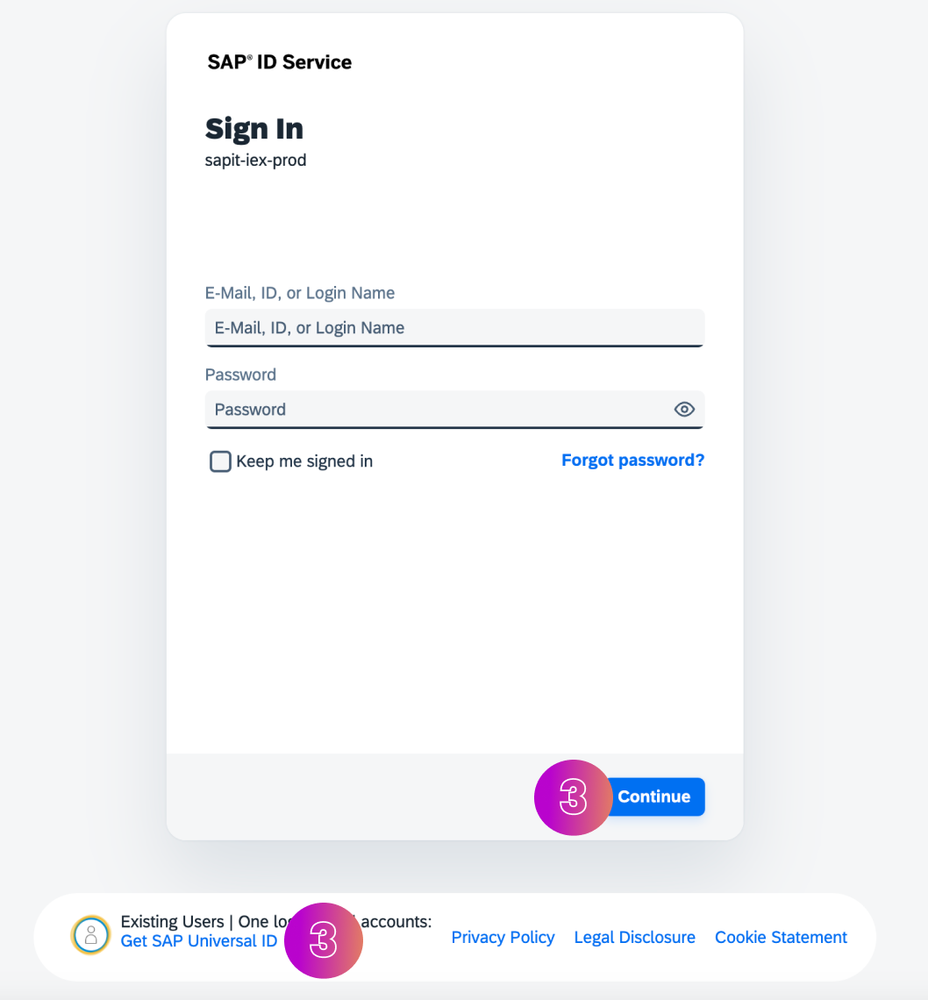

4. Click on the little bell icon in your Work Zone account to go to your notifications.

5. Access the SAP Build Governance Resource Center by clicking on *Join*.
    
    <!-- size:500px -->
    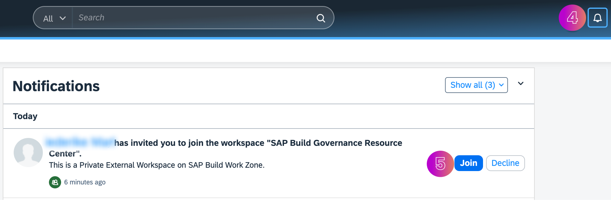

6. Scroll down in the SAP Build Governance Resource center and click on *Click here to get the template.*
    
    <!-- size:500px-->
    

7. Now just click on the file-name to download the template to your personal device!
    
    <!-- size:500px -->
    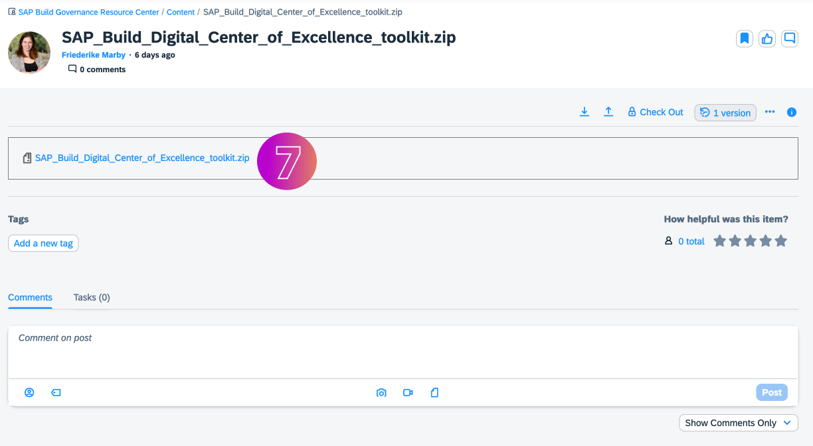

### Import the template
1. Go to the Administration console of Work Zone. Please note that you only do that when you have Admin rights. Please ask your technical administrator for support.
   
    <!-- size:800px -->
    

2. Choose from *Area & Workspace Configuration*  the option *Workspaces*.
 
4. Click on *Import Workspace* on the left.
    
    <!-- size:600px -->
    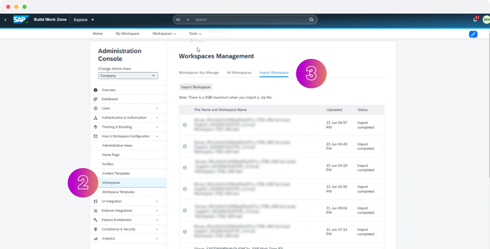

5. Click on *Import Workspace* and choose the right .zip-file which was provided to you.
    
    <!-- size:600px -->
    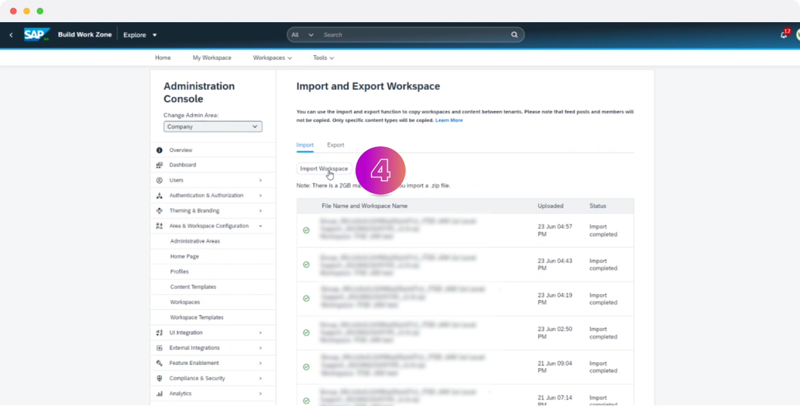

>REALITY CHECK: You just imported the template and can now start working on it further!

### Spice up the Overview page

>Make everyone feel welcome and offer the most important information! Customize your name & description so that your Community directly gets engaged and inspired!

1. Think about replacing the banner and your introduction text. It will be the first thing your Citizen Developer are going to see once they visit this page. What do you want their first impression to be like?

2. Customize your *How to get started* area. What are the steps at your company to become a Citizen Developer?
      - Link the *Get access* call-to-action to the sub-page *Access & Rules* of this Work Zone page. Do so by copying the link from the Access & Rules page and insert it as a link to the respective clickable word(s).
      - Link the *Forum* to the forum in this Work Zone page to get connected. Do so by copying the link from the Forums page and insert it as a link to the respective clickable word(s).
    
    <!-- size:600px -->
    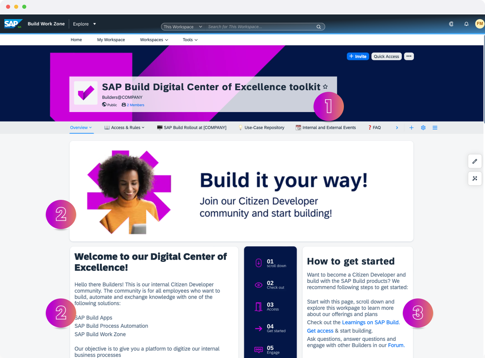

4. Customize your *Do you need help?* area. Lots of citizen developer will visit this page once they are stuck and need help. That's why the call-for-help approach is on the first page. Do you want to offer weekly help sessions like this proposal for the troubleshooting sessions? Do you want to just describe how to get help?
      - In case you want to offer an format: Link the *Events page* from your Work Zone page. Do so by copying the link from the *Internal and External Events* page and insert it as a link to the respective clickable word(s).
    

5. Fill in the news section with the latest news posts, blogs or interesting documents you want to link. This way everyone will stay up-to-date. SAP also publishes a lot of new content on a regular basis.
   
6. Take a look at the description of SAP Build. Is this sufficient for your company? Do you want it to have more or less information? Do you want to link any other resources of information or a quote from your executives describing it in their own words?
    
    <!-- size:600px -->
    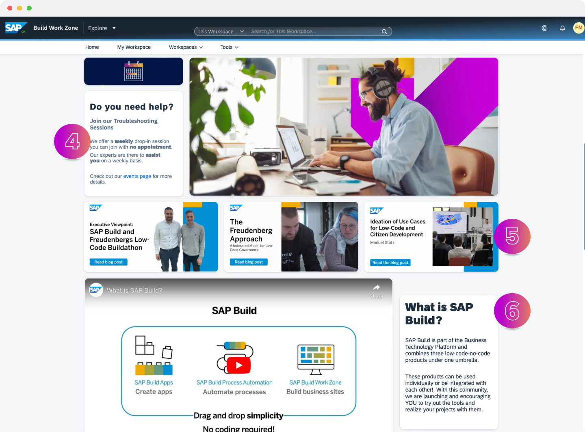

7. Link the correct Work Zone product pages to the widgets. Do so by copying the link from the right Work Zone page and insert it as a link to the respective clickable word.
    - Link SAP Build Apps page to *business applications*
    - Link SAP Build Process Automation page to *business processes*
    - Link SAP Build Work Zone page to *business sites*
  
8. Are there any news or important information you want your Citizen Developers to have at the first place? In this widget you can easily position them.
    
    <!-- size:600px -->  
    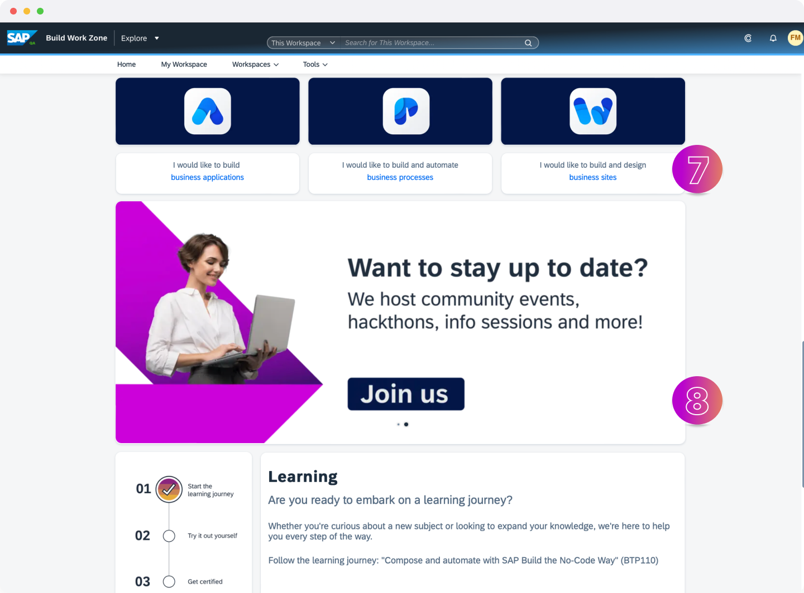

9.  Link the correct respective Work Zone pages to the following pages:
    - The Forum to *Forums* in order for everyone to find help quickly by asking others. Copy the link from the Forums page and insert it as a link to the respective clickable word(s).
    - Link the FAQ page to the *FAQs*. Do so by copying the link from the FAQ page and insert it as a link to the respective clickable word(s).
  
10. Your Citizen Developer will all have different expectations and motivations coming to this page. With the area *Managing expectations* you can chime in and directly explain what this page is about and what your own situation and goal is. Being transparent about that will help building your community and also bring everyone to a joint course.
    
    <!-- size:600px -->
    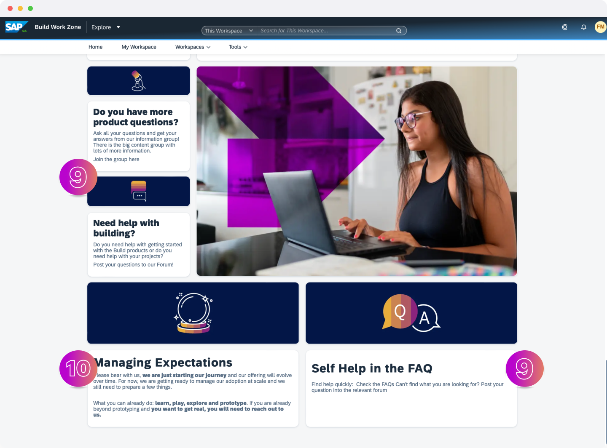

### Customize the Product pages

> With the product pages you offer product specific information and explanations to enable everyone!

1. Think about replacing the banner. Is there maybe an engaging photo of something you already built or some people from your own community? This will spark interest and will reduce the hurdles to get started because the own colleagues already started it.
    
    <!-- size:600px -->
    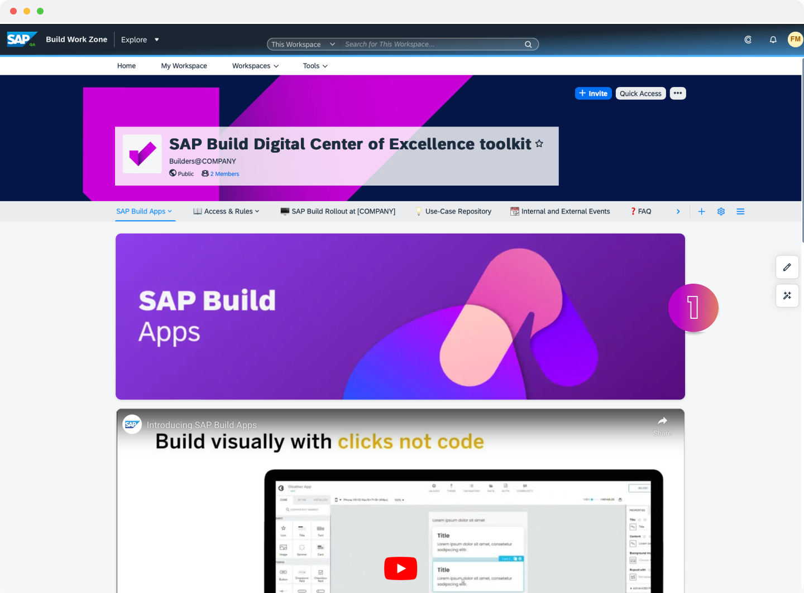

2. Customize your direct Call-to-Action to get access to your alpha phase or directly point them to your *Access & Rules* page for them to start their building career. Do so by copying either the link from the *Access & Rules* page or your link to directly get access to the solution and insert it as a link to the respective clickable word(s).
    
    <!-- size:600px -->
    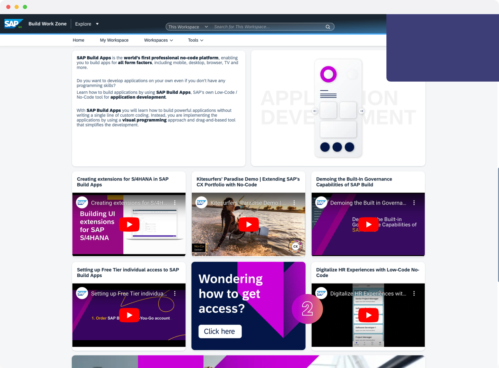

3. Customize your Call-to-Actions for your Citizen Developers to get directed to the Forum or to the FAQs.
    - Link the *Forum* to *Forum* in order for everyone to find help quickly by asking others. Do so by copying the link from the Forums page and insert it as a link to the respective clickable word(s).
    - Link the *FAQ* page to the *FAQs*. Do so by copying the link from the *FAQ* page and insert it as a link to the respective clickable word(s).
  
4. Do you have your own social feeds or different places where you spread information? Here you can link all that and add pictures as big call-to-actions and link your respective pages. If you don’t have any other pages – keeping the SAP channels will always be a great source of inspiration and for gaining great insights.
    
    <!-- size:600px -->
    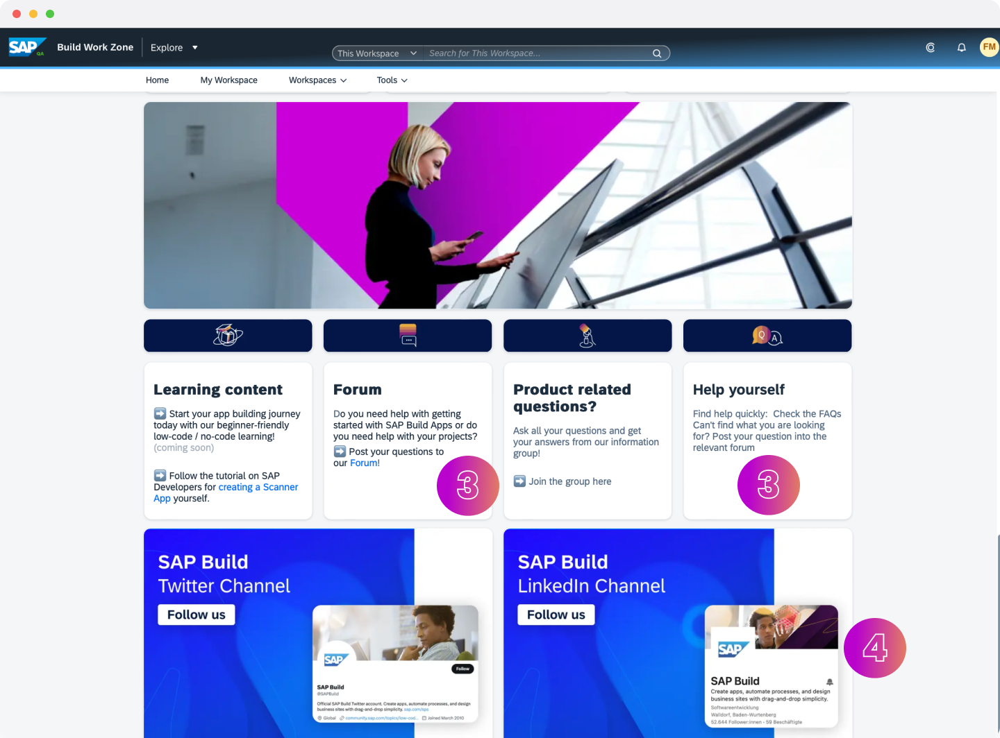

5. **Repeat all of the tasks for the other Product pages:**
  - SAP Build Process Automation
  - SAP Build Work Zone

### Provide information about access & rules

>With the access & rules page you will provide access to the tools for everyone and set the stage for the usage!

1. How do you want to guide your Citizen Developers? This page will provide information on that process to your community. Change your *How to get access* text and describe your plan of usage. You might also want to already make your Citizen Developers aware of your security and compliance regulations as well as agree on your rules.

2. Do you want to provide a sandbox system to your Citizen Developers? Some of them might want to have an extra-safe space to start developing without the fear of “breaking anything”. If so, tell them and also highlight the advantages by using that kind of environment for them – not everyone is familiar with these kind of system landscapes. 

3. Swap out the banner and create your own call-to-action for your employees to directly get access with one click. This could lead them for instance to your testing environment where they can directly start building.
   
    <!-- size:600px -->
    

4. What are important information you would want your Citizen Developers to have? Here you can link your security guidelines, IT strategy or in general your guiding principles. Feel free to include everything that would be helpful and beneficial. It might already answer some of the questions your Citizen Developer would ask later on.
   
5. Make your network stay active and have people they can approach directly. This will help your community to start building and actively stay engaged – otherwise they might stop when they are stuck at some point. 
Who knows the best about Data Protection and Privacy or Security? Add the respective colleagues to the Work Zone page and make them visible. 
    
    <!-- size:600px -->
    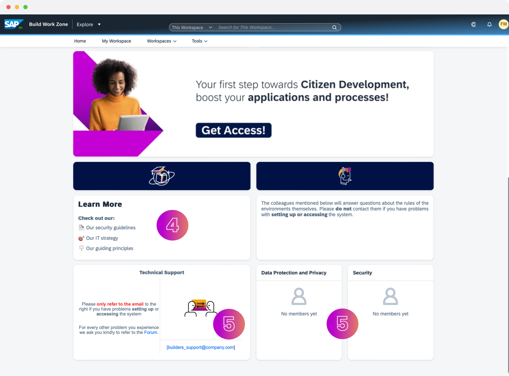

### Give out your Alpha-Phase manual

>With the alpha-phase manual you make everyone be aware of the situation and follow your rules!

1. Do you want to gradually roll out SAP Build in phases, such as alpha, beta, etc. before making it broadly available? The Alpha-Phase page is the place to tell your Citizen Developer about it. Explain why you chose a phased approach and what would be the benefits for them.

2. Having a smaller or bigger set of rules can help everyone developing in a safe setting and feel comfortable knowing whats allowed and what’s rather not be done. Here you can add your Do’s and Don’t to describe your own environment.
    
    <!-- size:600px -->
    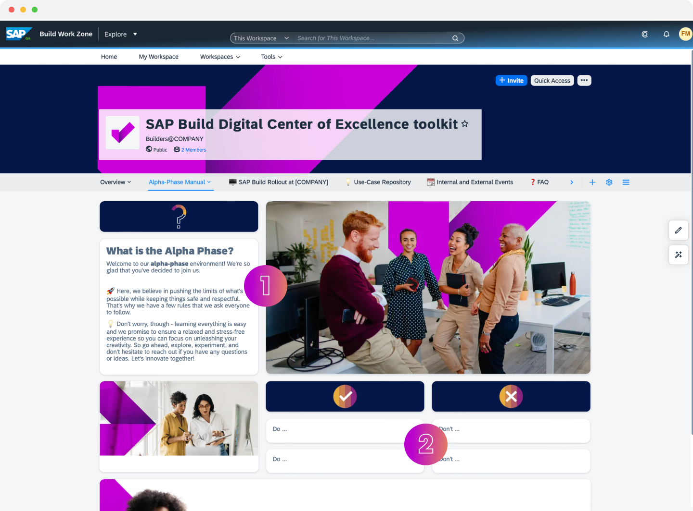

3.  Add your call-to-action banner to again guide your Citizen Developer to get access after they read the rules.
    
    <!-- size:600px -->
    

### Personalize the motivation and timeline

> With this page you explain the motivation and goal and keep everyone aligned on the timeline!

1. Your Citizen Developer will wonder what the ultimate goal of the rollout is: *Why are we using it? What is the purpose? What will change for us?*. Here you can answer these questions and provide answers. Understanding the background of projects always makes a big difference in the successful adoption and usage of the proposed solution afterwards.
    
    <!-- size:600px -->
    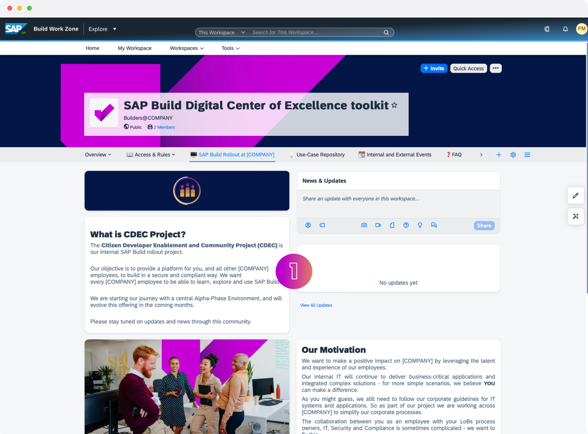

2. Having a written motivation statement strengthens the understanding of the purpose. This way your Citizen Developers are really aligned with your motivation. Customize this text and make it reflect your very own motivation and goal.
   
3. What is the plan for the next months? Maybe your Citizen Developer will decide to start their journey at a later point of time or they simply want to know what to expect in the upcoming time. By customizing this project pipeline with the given PowerPoint Template in the Contents area of the template you can visualize your next goals and milestones. You can also think about adding a call-to-action here for employees to join a specific beta-phase or a feedback-cycle. It’s up to you! 
    
    <!-- size:600px -->
    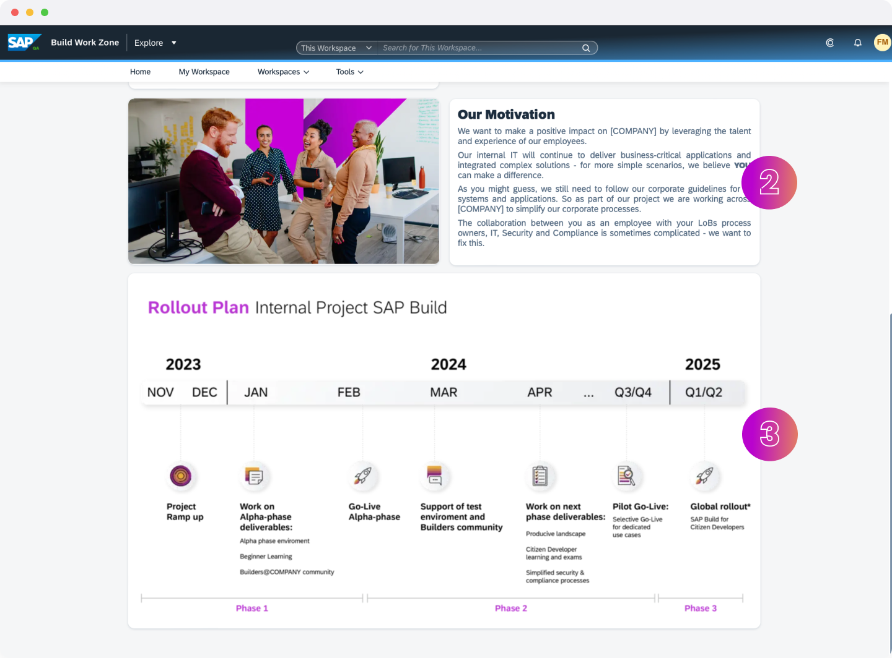

### Adapt the Use-Case Repository to your needs

> With this page you gather your Use-Cases centrally and let others see whats already built

1. One of the biggest hurdles to start building is uncertainty about what is possible. With this Use-Case repository and the active collaboration of your community this page will turn into an active view of your low-code portfolio that everyone can see and know what is “already out there”. Think about customizing the intro text and make everyone at your company understand the benefit and purpose of this page!

2. By using the Knowledge-Base feature, every new Use-Case which is uploaded to the Work Zone page from your Citizen Developer will automatically appear in this list and turn the Use-Case Repository into an actively used page. Take a look at the settings of the widget – how many entries do you want to be shown? How do you want it to be sorted?

    <!-- size:600px -->
    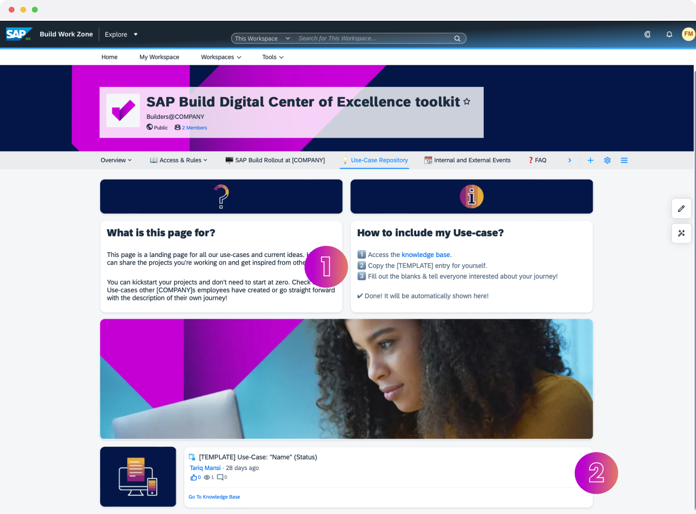

3. Take a look at the template of the „Use-Case template“ entry which is provided. Are the requested information sufficient? Do you want to include different types of information? Just directly change the template and make it visible to everyone.

    <!-- size:600px -->
    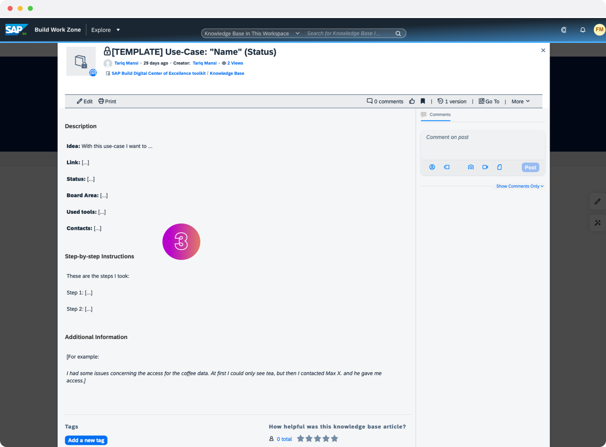

### Change up your upcoming formats and interactions

> With this page you keep everyone up-to-date about upcoming events and formats!

1. Think about different formats and sessions you might want to offer to your Citizen Developers. What would be helpful and will be actively used? Fill in the information on the overview widget to make everyone get the information about the different types at one glance.
    
   <!-- size:600px -->
   

2. What is your main format to engage with your community? Highlight it in this area and also make slides/recordings etc. accessible for everyone wanting to learn more.
   
3. What are your next internal events? Describe them here. You can even add calender invites for your employees to directly add them into their calendars and be ready once the respective day is reached.
   
4. What are different types of information and insiders who also have valuable insights? Here you can link interesting external events for everyone to think even outside the box.
    
    <!-- size:600px -->
    

### Personalize the FAQ and add your questions

> With this page you answer questions before they reach your tech support and thus boost Citizen Developer productivity!

1. Think about your most common asked questions or things that you personally wondered about working with SAP Build.
Divide these questions into useful groups and answer them in this FAQ format.
   
    <!-- size:600px -->
    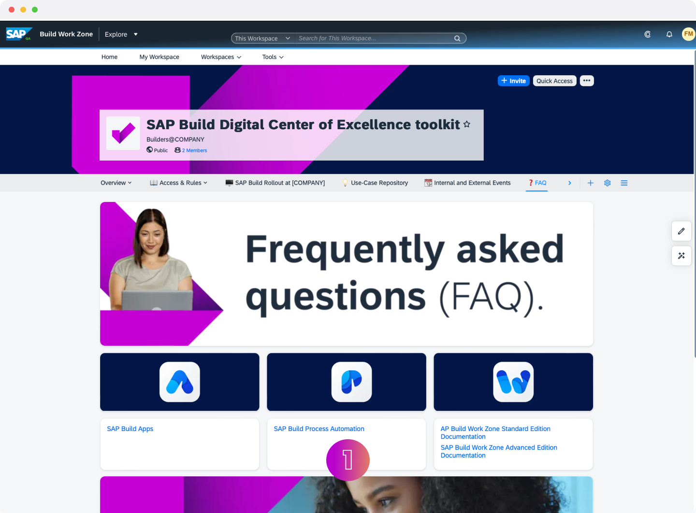

1. To add a new question copy one of the previous entries in the *Content > FAQ* area and customize the title and content of the FAQ entry. Afterwards copy the link to the content entry in the FAQs page. There include it as a link to the respective clickable question.
    
    <!-- size:600px -->
    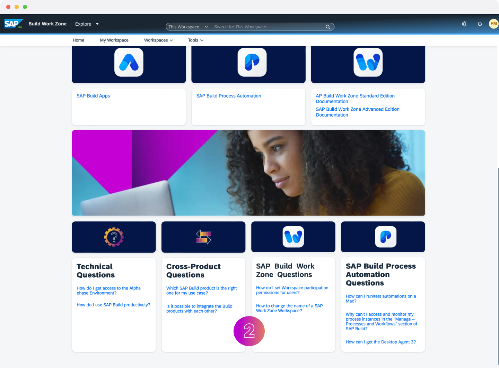

### Congrats!

As we conclude this tutorial, congratulations you on your journey toward establishing a **Digital Center of Excellence (CoE) for SAP Build**. By becoming familiar with the processes and strategies required to set up such an important resource center, you are not just enhancing your own capacities as an IT admin, but also enabling your organization to broaden its technological horizons.

Remember, the Digital CoE is more than a resource center — it's the **heartbeat of your organization's citizen development **activities. All the knowledge, assets, and collaborations will drive your teams towards building innovative and efficient solutions. 

You're now equipped to guide and empower citizen developers, standardize practices and safeguard your organization against possible challenges associated with the wide adoption of low-code development.

May your Digital CoE thrive as a destination for learning, problem-solving, and innovation! It will play an instrumental role in driving digital transformation, enhancing productivity and fostering a culture of self-service citizen development within your organization.

> Well done, and keep on building!