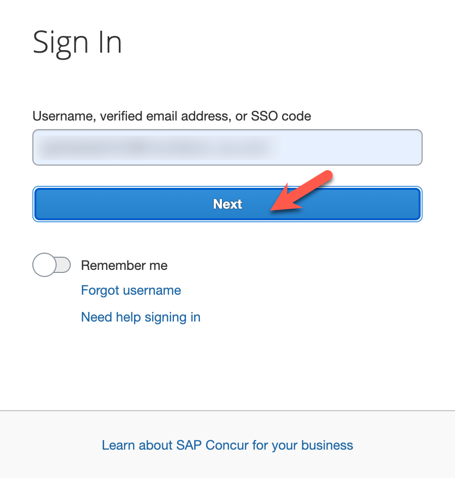
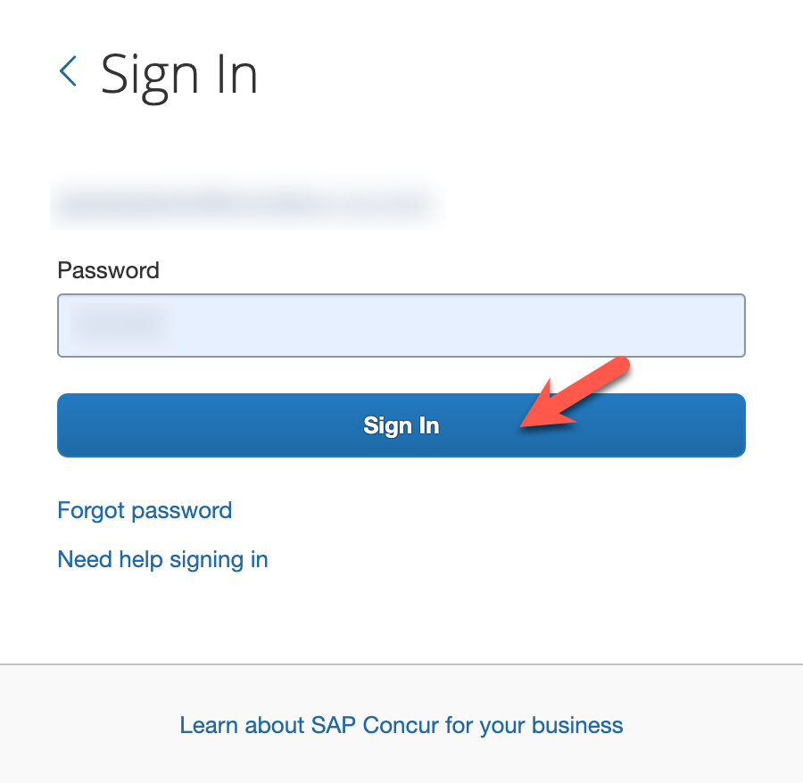
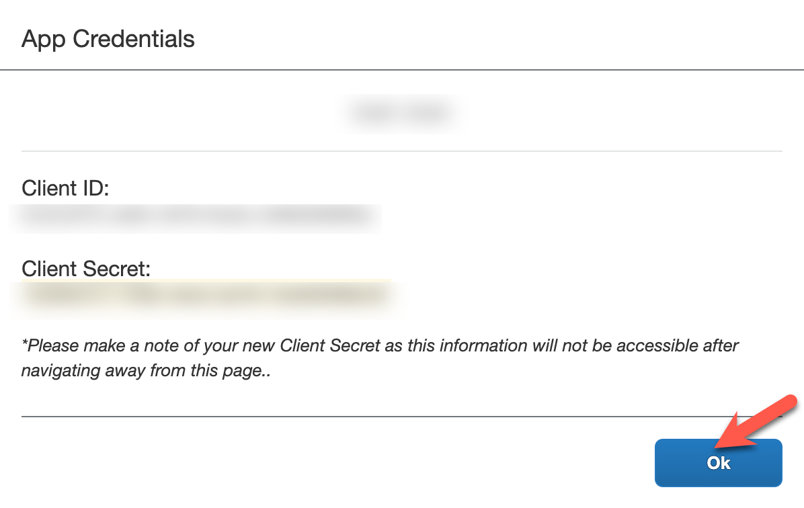

# Create Tokens Required for Concur API Access
<!-- description -->Create an app with a company request token to create a refresh token for API access.

## Prerequisites  
 - SAP Concur instance credentials
 - [Node.js](https://nodejs.org/)
 - [GitHub account](https://github.com/)
 - IDE or text editor

## You will learn
  - How to create a new app
  - How to generate your company request token from the app
  - How to create your ``credentials.json`` file using information from the app and the company request token
  - How to create a refresh token from an API call using the ``credentials.json`` file

---

### Login to your Concur admin panel
1. Login to your [**Concur admin panel**](https://www.concursolutions.com/nui/ocstool).
2. Enter your user ID and click **Next**.
        <!-- border -->
3. Enter your password and click **Sign In**.
        <!-- border -->  

### Create a new app
1. Go to the [**OAuth 2.0 Application Management**](https://www.concursolutions.com/nui/ocstool) screen.
2. Click **Create new app**.
        <!-- border -->
3. Fill in all of the required fields and add all of the grants and scopes you have access to.
        <!-- border -->
4. Click **Submit** when the form is completed.
        <!-- border -->
5. Copy and paste your Client ID and Client Secret to a text file.
        <!-- border -->
6. Click **OK** when completed.
        <!-- border --> 

### Generate your company request token
1. Go to the [**Company Request Token**](https://www.concursolutions.com/nui/authadmin/companytokens) screen.
2. Enter your App ID in the required field and click Submit to generate your company request token.
3. Copy/paste the Company UUID and company request token fields to a text file.
        <!-- border -->
4. Click **OK** after you have saved this information to a text file.
        <!-- border -->

### Setup the Node.js app
1. Get the [Node.js sample code](https://github.com/SAP-samples/concur-api-samplecode).
2. Open ``SampleCode/Tutorial_1/GetRefreshToken.js`` in your IDE or text editor.

### Generate your credentials file
1. Type ``node GetRefreshToken.js`` in terminal to run the app to generate your ``credentials.json`` file. This generates messages in the terminal that show the credentials object.
        <!-- border -->
        <!-- border -->
2. Fill in the empty fields in this file with the information in the credential object.
        <!-- border -->

### Generate your refresh token
1. Run the app again. The app will call the Oauth2 /token endpoint using your credentials and generate your refresh token.
        <!-- border -->
2. Check if your credentials were transferred from the JSON file to the credentials object. 
3. Check for a successful validity check on the credentials object.
4. Check for a successful API call. The status code will be 2xx and the refresh token will be one of the refresh token object properties.
        <!-- border -->

---
