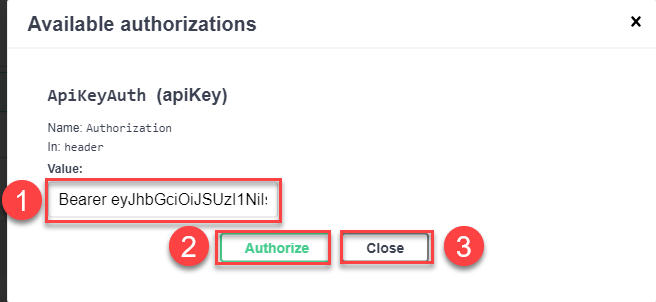
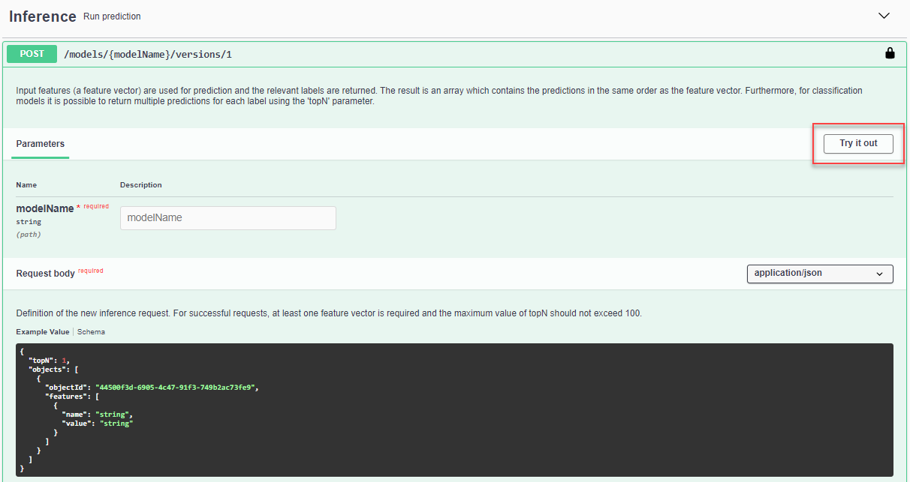
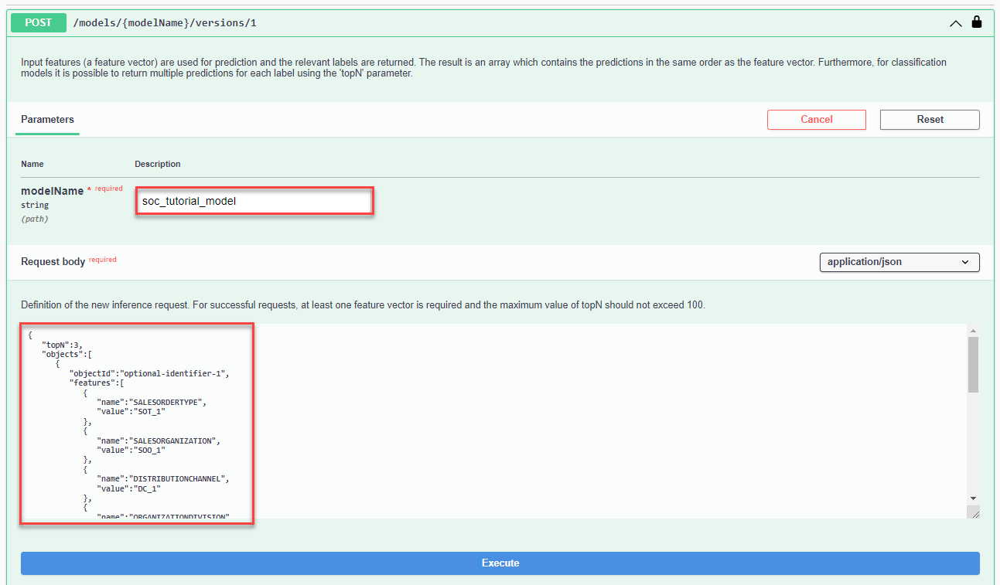
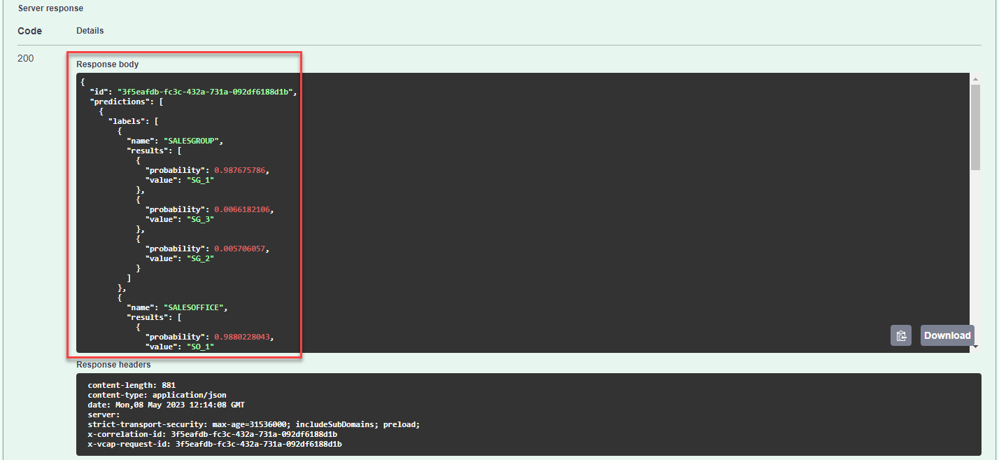
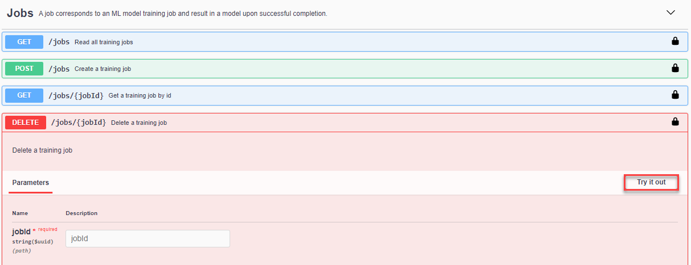

# Use the Sales Order Completion (SOC) Business Blueprint to Predict Missing Sales Order Fields
<!-- description --> Get recommendations for missing fields in sales order documents using your machine learning model.

## You will learn
  - How to predict missing fields in sales order documents using your machine learning model
  - How to `undeploy` and delete your model
  - How to delete datasets and dataset schemas

---

### Authorize Swagger UI


In the service key you created for Data Attribute Recommendation in the previous tutorial: [Use Free Tier to Set Up Account for Data Attribute Recommendation and Get Service Key](cp-aibus-dar-booster-free-key) or [Use Trial to Set Up Account for Data Attribute Recommendation and Get Service Key](cp-aibus-dar-booster-key), you find a section called `swagger` (as highlighted in the image below) with three entries, called `dm` (data manager), `mm` (model manager) and `inference`.

<!-- border -->

For the following step, copy the URL of the Swagger UI for `inference` and open it in a browser tab. The Swagger UI for inference allows you to classify new data using your machine learning model that you have created in [Use the Sales Order Completion (SOC) Business Blueprint to Train a Machine Learning Model](cp-aibus-dar-swagger-soc-model).

1. To be able to use the Swagger UI endpoints, you need to authorize yourself. In the top right corner, click **Authorize**.

    <!-- border -->

2. Get the `access_token` value created in the previous tutorial: [Get OAuth Access Token for Data Attribute Recommendation Using Any Web Browser](cp-aibus-dar-web-oauth-token), then add **Bearer** (with capitalized "B") in front of it, and enter in the **Value** field.

    ```
    Bearer <access_token>
    ```

3. Click **Authorize** and then click **Close**.

    <!-- border -->


### Predict missing sales order fields


To get the machine learning model predictions, proceed as follows:

1. Expand the endpoint `POST /models/{modelName}/versions/1` by clicking on it. Then click **Try it out**.

    <!-- border -->

2. Fill the parameter `modelName` with the name of your machine learning model (`soc_tutorial_model`).

3. In the parameter `body`, you have to provide the data that needs to be predicted. According to the dataset schema that you have created in [Use the Sales Order Completion (SOC) Business Blueprint to Upload Data to Data Attribute Recommendation with Swagger UI](cp-aibus-dar-swagger-soc-upload), the machine learning model takes the training fields such as `SALESORDERTYPE` and `SALESORGANIZATION` as input and predicts `SALESGROUP` and `SALESOFFICE`. Replace the text in the parameter `body` with the following:

    ```JSON
    {
       "topN":3,
       "objects":[
          {
             "objectId":"optional-identifier-1",
             "features":[
                {
                   "name":"SALESORDERTYPE",
                   "value":"SOT_1"
                },
                {
                   "name":"SALESORGANIZATION",
                   "value":"SOO_1"
                },
                {
                   "name":"DISTRIBUTIONCHANNEL",
                   "value":"DC_1"
                },
                {
                   "name":"ORGANIZATIONDIVISION",
                   "value":"OD_1"
                },
                {
                   "name":"MATERIAL",
                   "value":"M_1"                
                }
             ]
          },
          {
             "objectId":"optional-identifier-2",
             "features":[
                {
                   "name":"SALESORDERTYPE",
                   "value":"SOT_1"
                },
                {
                   "name":"SALESORGANIZATION",
                   "value":"SOO_3"
                },
                {
                   "name":"DISTRIBUTIONCHANNEL",
                   "value":"DC_1"
                },
                {
                   "name":"ORGANIZATIONDIVISION",
                   "value":"OD_3"
                },
                {
                   "name":"MATERIAL",
                   "value":"M_1"                
                }
             ]
          }
       ]
    }    
    ```

4. Click **Execute** to send the above input to the service to get predictions for missing fields in sales order documents.

    <!-- border -->

In the response of the service, you find the probability and the values for `SALESGROUP` and `SALESOFFICE`. The probability represents how certain the model is about its prediction. The higher the probability the more confident the model is that the prediction is actually correct. If the probability is close to 1, the model is very certain. The service provides one main prediction and two alternative predictions for each `SALESGROUP` and `SALESOFFICE`.

<!-- border -->

```JSON
{
  "id": "3f5eafdb-fc3c-432a-731a-092df6188d1b",
  "predictions": [
    {
      "labels": [
        {
          "name": "SALESGROUP",
          "results": [
            {
              "probability": 0.987675786,
              "value": "SG_1"
            },
            {
              "probability": 0.0066182106,
              "value": "SG_3"
            },
            {
              "probability": 0.005706057,
              "value": "SG_2"
            }
          ]
        },
        {
          "name": "SALESOFFICE",
          "results": [
            {
              "probability": 0.9880228043,
              "value": "SO_1"
            },
            {
              "probability": 0.0082320822,
              "value": "SO_2"
            },
            {
              "probability": 0.0037451275,
              "value": "SO_3"
            }
          ]
        }
      ],
      "objectId": "optional-identifier-1"
    },
    {
      "labels": [
        {
          "name": "SALESGROUP",
          "results": [
            {
              "probability": 0.9952125549,
              "value": "SG_1"
            },
            {
              "probability": 0.003377331,
              "value": "SG_2"
            },
            {
              "probability": 0.0014101767,
              "value": "SG_3"
            }
          ]
        },
        {
          "name": "SALESOFFICE",
          "results": [
            {
              "probability": 0.9940330386,
              "value": "SO_3"
            },
            {
              "probability": 0.005349447,
              "value": "SO_2"
            },
            {
              "probability": 0.0006174785,
              "value": "SO_1"
            }
          ]
        }
      ],
      "objectId": "optional-identifier-2"
    }
  ],
  "processedTime": "2023-05-08T12:14:08.175907",
  "status": "DONE"
}
```

You have successfully used a machine learning model to predict missing fields in sales order documents. Feel free to adapt the examples above and retry the prediction.


### Undeploy your model


Now that you have learned the whole process about how to use the Sales Order Completion (SOC) Business Blueprint from the Data Attribute Recommendation service, it's time to clean up. This way, the technical limits won't get in your way when trying out other Data Attribute Recommendation tutorials. See [Technical Constraints](https://help.sap.com/docs/Data_Attribute_Recommendation/105bcfd88921418e8c29b24a7a402ec3/686d2ae094014c8085cebecdb1d37e37.html) and [Free Tier Option Technical Constraints](https://help.sap.com/docs/Data_Attribute_Recommendation/105bcfd88921418e8c29b24a7a402ec3/c03b561eea1744c9b9892b416037b99a.html).

First, `undeploy` your model. For that, go back to the Swagger UI for `mm` and:

 1. Expand the endpoint `DELETE /deployments/{deploymentId}` by clicking on it. Then click **Try it out**.

     <!-- border -->

 2. Fill the parameter `deploymentId` with the ID of your deployment. Use the `GET /deployments` endpoint in case you no longer have the deployment `id` in hand.

     <!-- border -->

If the response code is `204`, the model has been successfully `undeployed`.

<!-- border -->

You have successfully `undeployed` your model, but the model is not yet deleted. Instead it isn't in production which means that you cannot make inference requests. You can deploy it again at any time using the `POST /deployments` endpoint.


### Delete your model


Once `undeployed`, you can delete your model.

1. Expand the endpoint `DELETE /models/{modelName}` by clicking on it. Then click **Try it out**.

    <!-- border -->

2. Fill the parameter `modelName` with the name of your machine learning model (`soc_tutorial_model`). Use the `GET /models` endpoint in case you no longer have the model `name` in hand.

    <!-- border -->

If the response code is `204`, the model has been successfully deleted.

<!-- border -->


### Delete your training job


Now that the model is deleted, you can delete the training job that created the model.

1. Expand the endpoint `DELETE /jobs/{jobId}` by clicking on it. Then click **Try it out**.

    <!-- border -->

2. Fill the parameter `jobId` with the ID of your training job. Use the `GET /jobs` endpoint in case you no longer have the job `id` in hand.

    <!-- border -->

If the response code is `204`, the training job has been successfully deleted.

<!-- border -->


### Delete your dataset


To clear the uploaded data, you can now delete the dataset as the associated training job is already deleted. For that, go back to the Swagger UI for `dm` and:

 1. Expand the endpoint `DELETE /datasets/{id}` by clicking on it. Then click **Try it out**.

     <!-- border -->

 2. Fill the parameter `id` with the ID of your dataset. Use the `GET /datasets` endpoint in case you no longer have the dataset `id` in hand.

     <!-- border -->

If the response code is `204`, the dataset has been successfully deleted.

<!-- border -->


### Delete your dataset schema


If you do not need your dataset schema anymore, you can delete it as well.

1. Expand the endpoint `DELETE /datasetSchemas/{id}` by clicking on it. Then click **Try it out**.

    <!-- border -->

2. Fill the parameter `id` with the ID of your dataset schema. Use the `GET /datasetSchemas` endpoint in case you no longer have the dataset schema `id` in hand.

    <!-- border -->

If the response code is `204`, the dataset schema has been successfully deleted.

<!-- border -->

Congratulations, you have completed this tutorial.