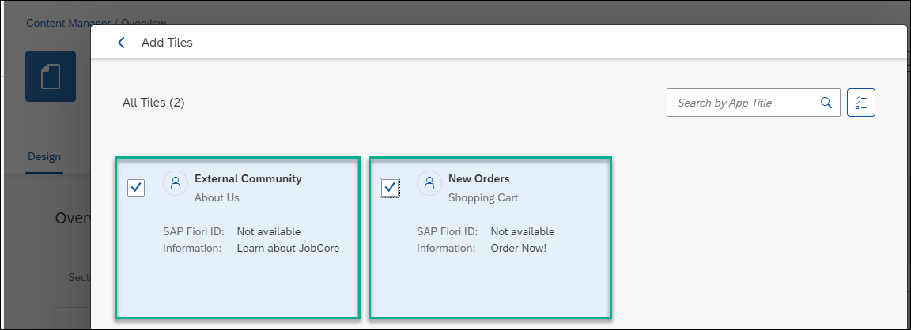
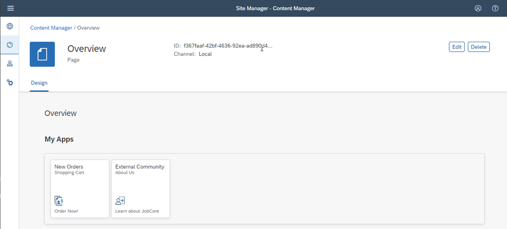
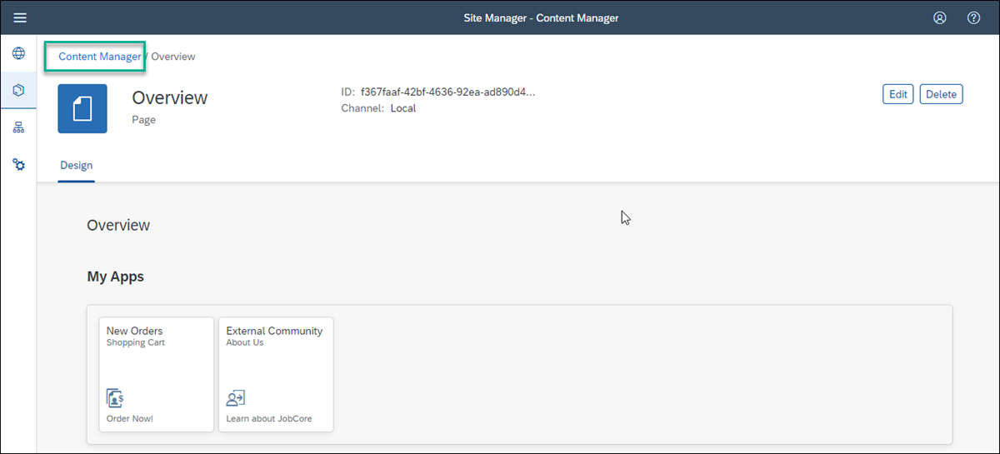
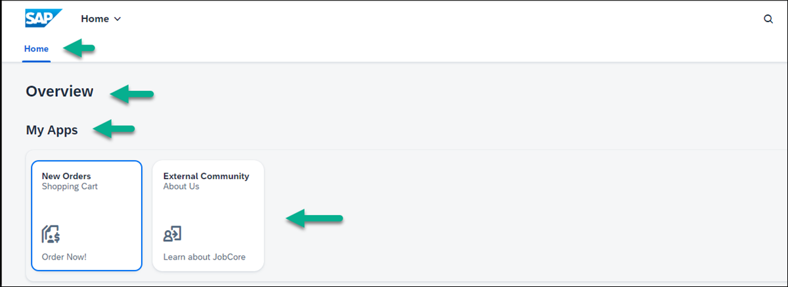

# Design Your Site With the New SAP Build Work Zone Experience
<!-- description --> Create a page, assign it to a space, and then add apps to your page.

## Prerequisites
- Make sure you've selected **Spaces and Pages - New Experience** view mode for your site in the Site Settings screen. 

## You will learn
  - How to create a page
  - How to add apps to a page 
  - How to create a space and assign pages to it                    

## Intro  
If you select the **Spaces and Pages - New Experience** view mode, you can create custom Spaces and Pages. A Space consists of Pages, a page consists of a single or multiple sections, a section consists of a single or multiple tiles (apps) and Cards.

### Create a page

1. Open the Content Manager. 

    

2. Click **Create** and from the dropdown list, select **Page**.

    

3. Enter a title for the page: `Overview`.

    

### Add apps to the page    

1. In the **Design** tab, click **Edit**.

    

2. Click **Add Section**.

    

3. Give the section a title, `My Apps` and click **Add Widget**.

    

4. In the **Add Widgets** screen, click **Tiles**.

    > In this screen you'll see all the apps that you can access from your subaccount. 

    

5. Select the `External Community` and the `New Orders` apps and click **Add**.

    > You can select one or more apps to add to your page - they will display side by side in a section.

    

6. Click **Save**. This is how your page looks:

    

7. Go back to your Content Manager using the breadcrumbs at the top.

    

8. See that the page you created is in the list of content items.

    

### Create a space

1. In the Content Manager click **Create** and then select **Space**.

    

2. Enter a title for the space: `Home`.

    

3.  In the **Pages** tab, you'll see a list of pages and from here you can assign as many pages as you want to the space. We only have 1 page - the `Overview` page. From the **Assignment Status** column, click the toggle to assign the `Overview` page to the `Home` space.

    

4. Click **Save**. 

    

5. Go back to the Content Manager using the breadcrumbs at the top. You'll see that the space you created is added to the list of content items.

### Assign the space to a role

In this step, you'll assign the space to the `Everyone` role. 

>Spaces are assigned to a role and users assigned to a specific role are able to access the space and see the relevant pages assigned to it.Content assigned to the `Everyone` role is visible to all users.

1. From the Content Manager, click the `Everyone` role.

    

2. Click **Edit**.

    

3. Under the **Spaces** tab, you'll see the `Home` space you just created. Click the toggle to assign the `Home` space to the `Everyone` role. Then click **Save**.

    

### View the runtime site

1. Open the Site Directory.

    

2. On the `JobCore` tile, click the Go to Site icon.

    

3. This is what you'll see - under the `Home` space, you have the `Overview` page. In the `My Apps` section, you have the 2 apps `External Community` and  `New Orders` that you added.

    
