# Use the Migration Tooling 
<!-- description --> The migration tooling is a feature in the Cloud Integration capability of the SAP Integration Suite. It enables you to semi-automate the migrations of integration scenarios from SAP Process Orchestration to SAP Integration Suite.

## Prerequisites
- You can refer to the [documentation](https://help.sap.com/docs/integration-suite/sap-integration-suite/add-sap-process-orchestration-system) to learn how to establish a connection between your SAP Process Orchestration system and the SAP Integration Suite migration tool so to fetch the SAP Process Orchestration objects from Integration Directory and Enterprise Service Repository.

> Optionally, before you migrate an integration scenario, you can assess the migration of the integration scenarios using the Migration Assessment capability of SAP Integration Suite. For more information, see the [Migration Assessment documentation](https://help.sap.com/docs/integration-suite/sap-integration-suite/5c5e50ee2d644cc59d864409d5b7871c.html) and the blog [How to use the Migration Assessment Application to get read to migrate your SAP Process Orchestration Scenarios](https://blogs.sap.com/2023/02/28/how-to-use-the-migration-assessment-application-to-get-ready-to-migrate-your-sap-process-orchestration-scenarios/).
  

For more introductory information, benefits of the migration tool, and roadmap items, see the SAP blog [Migration tool in Cloud Integration Capability of SAP Integration Suite](https://blogs.sap.com/2023/01/27/migration-tool-in-cloud-integration-capability-of-sap-integration-suite/).
 
 
## You will learn
- How to use the migration tool
- How to connect to SAP Process Orchestration system and migrate an integration scenario
  
> After running the assessment, each integration configuration object is assigned a migration status. The possible migration statuses for integration configuration objects are **Evaluation required**, **Adjustment required**, and **Ready to migrate**. Currently, only integration configuration objects in status **Adjustment required** or **Ready to migrate** can be migrated.
> Integration scenarios in the SAP Process Orchestration system map to integration scenario patterns. Each pattern has been analysed and matched against scenario templates delivered as part of the migration tool in Cloud Integration.
> Every integration configuration object that can be migrated has an associated template in the migration tool. Based on the information provided in the templates, the migration tool creates the equivalent integration flows in SAP Integration Suite.

Now let’s go through the process of a scenario migration using the migration tool.

In the following steps, we'll migrate a point-to-point asynchronous scenario, which has SOAP adapters and mapping steps in the form of message mapping and XSLT mapping.

You can migrate the integration scenario of your choice, but be aware of the supported [components](https://help.sap.com/docs/integration-suite/sap-integration-suite/supported-components), [templates](https://help.sap.com/docs/integration-suite/sap-integration-suite/supported-templates) and [known limitations](https://help.sap.com/docs/integration-suite/sap-integration-suite/known-limitations).

---
### Migrate SAP Process Orchestration artifacts

1. Open the SAP Integration Suite launchpad, navigate to the design workspace of integrations, and create or open any existing integration package.

    <!-- border -->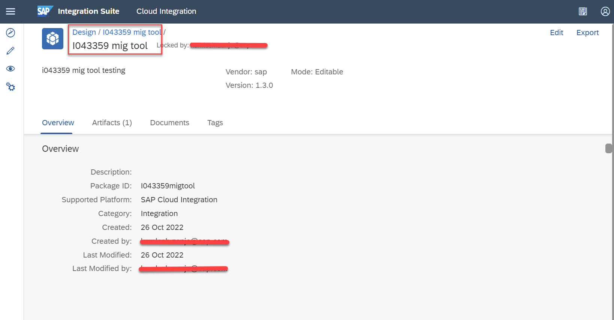

2. **Edit** the integration package. The **Migrate** appears, so you can migrate the integration scenarios from SAP Process Orchestration to SAP Integration Suite.

    <!-- border -->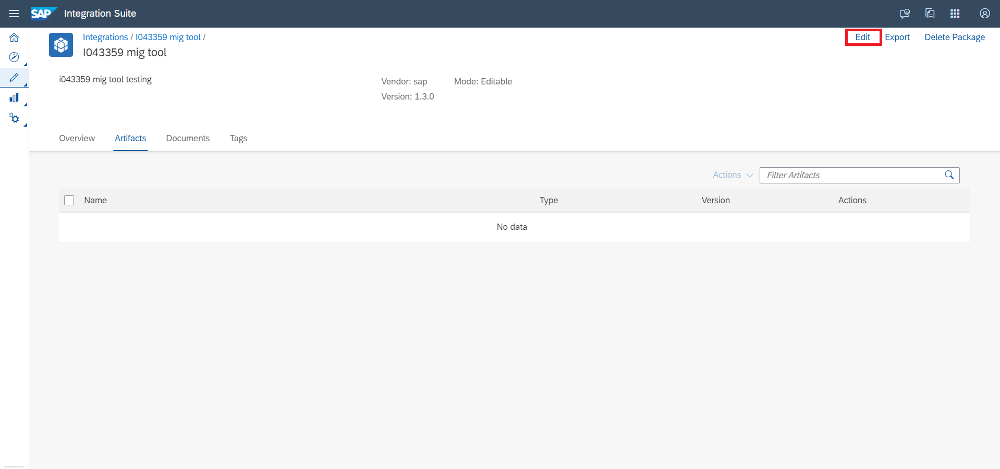

    <!-- border -->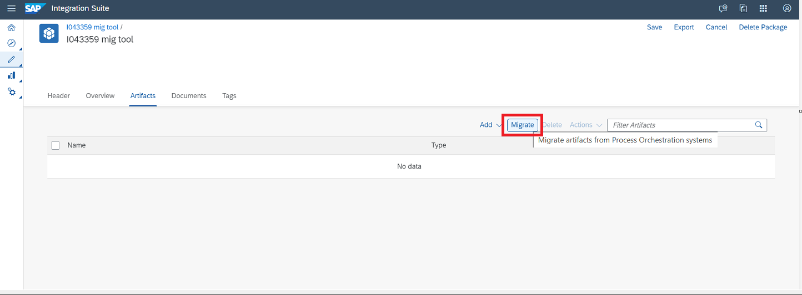

3. Choose **Migrate**. The migration tool opens as a wizard that guides you through the scenario migration.

    <!-- border -->

---

### Connect to SAP Process Orchestration System

1. Select the SAP Process Orchestration system and establish the connection. The SAP Process Orchestration systems added as part of **Add an SAP Process Orchestration System** are listed.

    <!-- border -->

2. Choose **Connect** to establish the connection. Once the connection has been established, continue with **Next Step**.

    <!-- border -->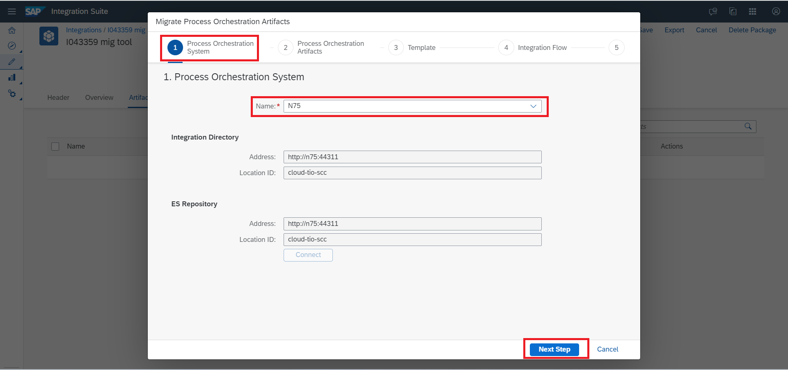

---

### Select the integration scenario to be migrated

1. In step **Process Orchestration Artifacts**, select the integration configuration object you want to migrate. All the integration configuration objects are fetched from the Integration Directory of the SAP Process Orchestration system. The **Type** selected is **Integration Configuration Object**, which is the only SAP Process Orchestration object currently supported. 

    <!-- border -->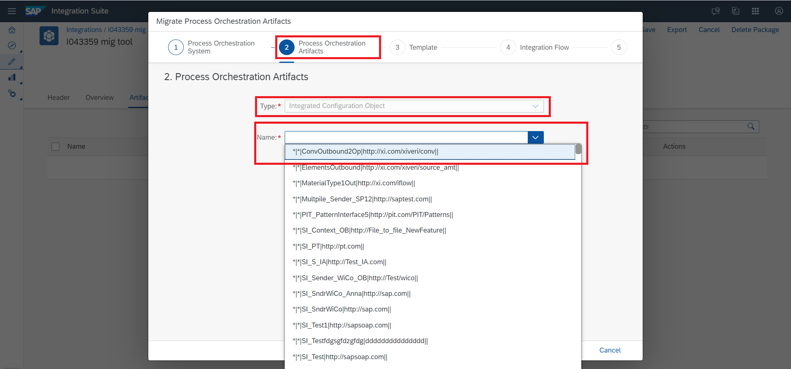

2. As the list can be rather long, filter the integration configuration objects using the regular expression in the search parameters. 
    
     Regular expression **(*)** is enabled in the search parameters to search the integration configuration objects. In the following example, **(*)** is used in the Sender Communication Component to filter integration configuration objects. You can use **(*)** in either of the search parameters to ease the filtering task.

    <!-- border -->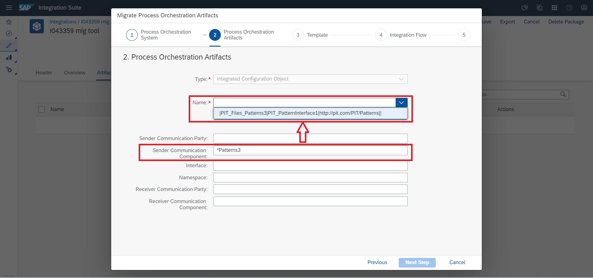

    In this example, the integration configuration objects are filtered by applying the **Sender Communication Component** parameter. Once an integration configuration object is selected for migration, choose **Next Step**.

    <!-- border -->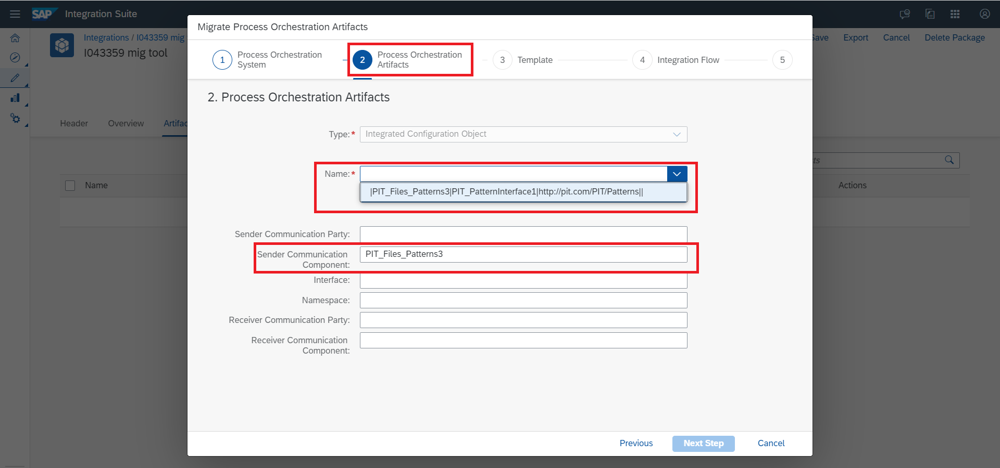

---

### Select the template applicable for the scenario

Templates associated with the integration configuration object are available for the selection from the drop-down list. You can select a template for the scenario migration. If you want to learn more about the template and what the resultant integration flow model will look like after the migration, use the context-sensitive help. 

<!-- border -->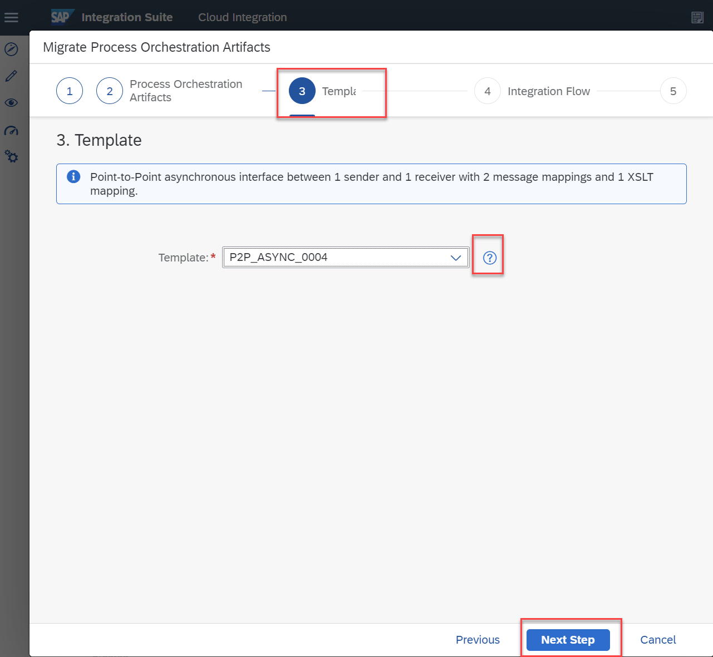

Every integration configuration object that is ready for migration also has a default template. If there are no associated templates available and yet the integration configuration object is ready for migration, the migration tooling falls back to the default template. Basically, default template creates a point-to-point integration flow; this template has neither the integration scenario nor the communication channels from the source integration configuration object. However, mapping objects such as message mapping, XSLT mapping etc. are copied and maintained in the point-to-point integration flow.

<!-- border -->

---

### Name the integration flow

In the **Integration Flow** tab, enter a meaningful integration flow name and ID and choose **Preview**.

The description field is automatically filled with the SAP Process Orchestration system name, scenario type and name, and template details for future reference.

<!-- border -->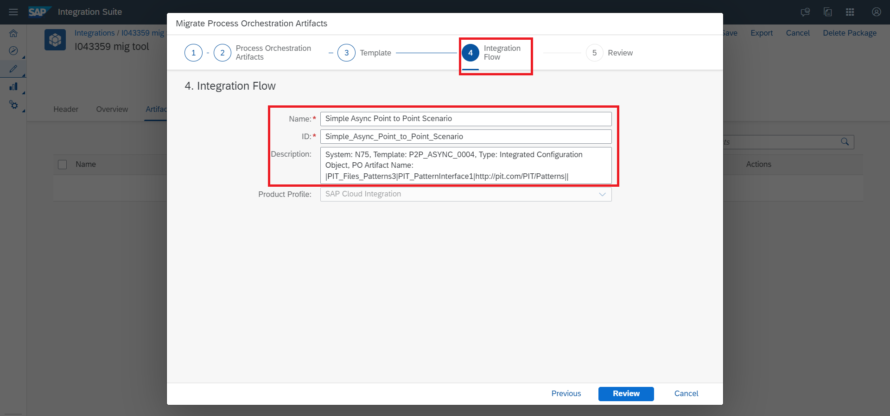

---

### Review details 

In the **Review** tab, check the details of your migration, then choose **Migrate**.

   <!-- border -->

After the integration scenario is successfully migrated from SAP Process Orchestration to SAP Integration suite, an integration flow is created in the artifact list of the package overview page.

  <!-- border -->

---

### View artifact

After the migration, a success page displays useful information and guidance on the next steps. In the success page, you can also see the equivalent channel/adapter mappings between SAP Process Orchestration and SAP Integration Suite, supported components and known limitations in the migration tool. 

Open the anticipated integration flow which is created after a successful migration by clicking on **View Artifact**.

<!-- border -->

 In this example, a point-to-point integration flow is created having SOAP Adapter, two message mappings and one XSLT mapping.

<!-- border -->

---

### Verify the configurations

All supported adapters are externalized to leverage the benefit of the externalized parameters.

1. Some configuration changes are required to ensure an integration flow is deployable. For example, in the Receiver SOAP Adapter, configure the proxy type as **On-Premise** and provide the associated **Location Id**.

    <!-- border -->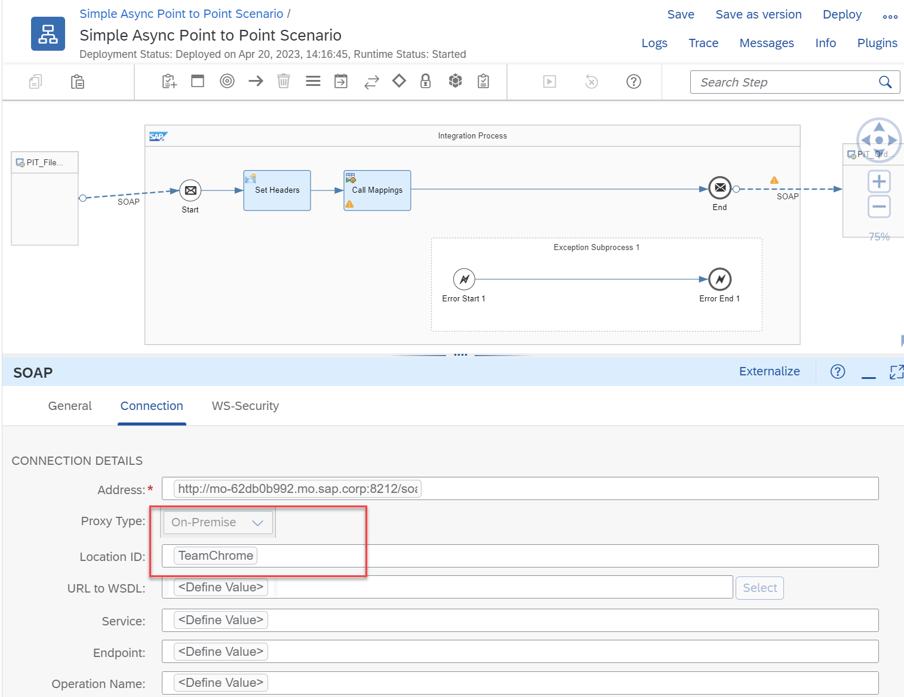

2. Select the XSLT mapping step and open the corresponding resource for verification. You can also verify the resources of the message mapping steps.

    <!-- border -->

---

### Deploy the integration flow

Process the messages by deploying the integration flow and triggering the endpoints as usual. Check if the security artifacts, like credential name and key alias, that are used in your integration scenario are correctly configured in the integration flow. Deploy the necessary security artifacts before you deploy the integration flow.

<!-- border -->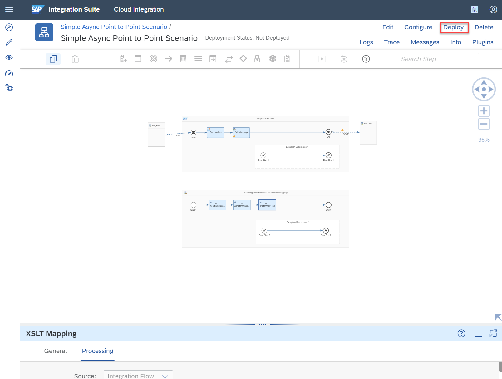

Congratulations! You've successfully migrated an integration scenario from SAP Process Orchestration to SAP Integration Suite.

### Test yourself 

---
